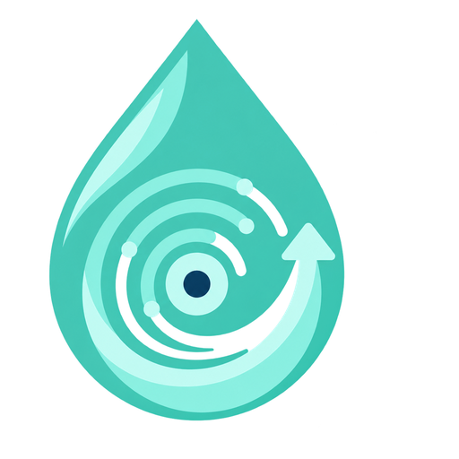

# 雨痕品牌视觉规范

## 品牌含义

“雨痕”表达数据被删除后仍可能在介质上留下可识别痕迹。标志由三部分构成：外部半透明水滴、内部盘片/数据轨迹、向上回返箭头。整体既像一滴清澈的雨，也像正在逆向找回数据的存储盘片。

## 标准标志

程序中的标准组合为：标志位于左侧，“雨痕数据恢复”位于右侧。小尺寸或任务栏场景只使用图形标志，不在图标内放置文字。

## 色彩

| 名称 | 色值 | 用途 |
|---|---|---|
| 雨痕玉青 | `#35B99E` | 主品牌色、按钮和标志主体 |
| 雨光浅青 | `#79E6CF` | 高亮、恢复轨迹和安全状态 |
| 深海军蓝 | `#0E1728` | 程序背景、内部盘芯与高对比场景 |
| 雾灰 | `#9BA8BC` | 辅助说明文字 |

## 安全距离与尺寸

- 标志四周至少保留图形宽度 8% 的透明空间。
- 独立图形建议最小显示尺寸为 20×20 像素；低于此尺寸只保留整体雨滴轮廓。
- 不拉伸、不旋转、不改变箭头方向，不增加投影、外框或其他文字。
- 深色背景优先使用标准版本；浅色背景应确保雨滴边缘仍有足够对比度。
- 水滴主体使用约 74%～89% 的真实 Alpha 不透明度；数据轨迹、箭头、盘芯和高光保持更高不透明度，禁止用棋盘格模拟透明。

## 资产清单

- `yuhen-logo-master.png`：1254×1254 透明背景主文件。
- `yuhen-logo-translucent-v2.png`：1254×1254、带真实 Alpha 的标准半透明品牌主文件。
- `yuhen-icon-512.png`：品牌展示与文档使用。
- `yuhen-ui-256.png`：程序界面内使用。
- `yuhen.ico`：包含 16、24、32、48、64、128、256 像素的 Windows 多尺寸图标。
- `tools/make_translucent_logo.py`：从原始主文件确定性生成半透明标准版本。
- `tools/build_brand_assets.py`：从半透明标准版本重复生成程序资产。

标志由内置图像生成工具制作，最终生成提示词记录在本文末尾，后续应从主文件派生尺寸，避免不同版本漂移。

## 最终生成提示词

> Preserve the approved “雨痕” geometry while making the teal raindrop feel modestly translucent like clean water. Retain exact tracks, nodes, hub and recovery arrow. Use a real RGBA transparent canvas, restrained glass-like refraction and strong small-icon contrast; never bake a checkerboard into the image.
